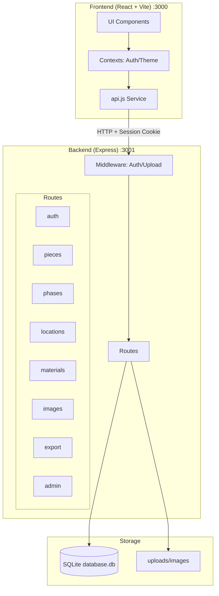
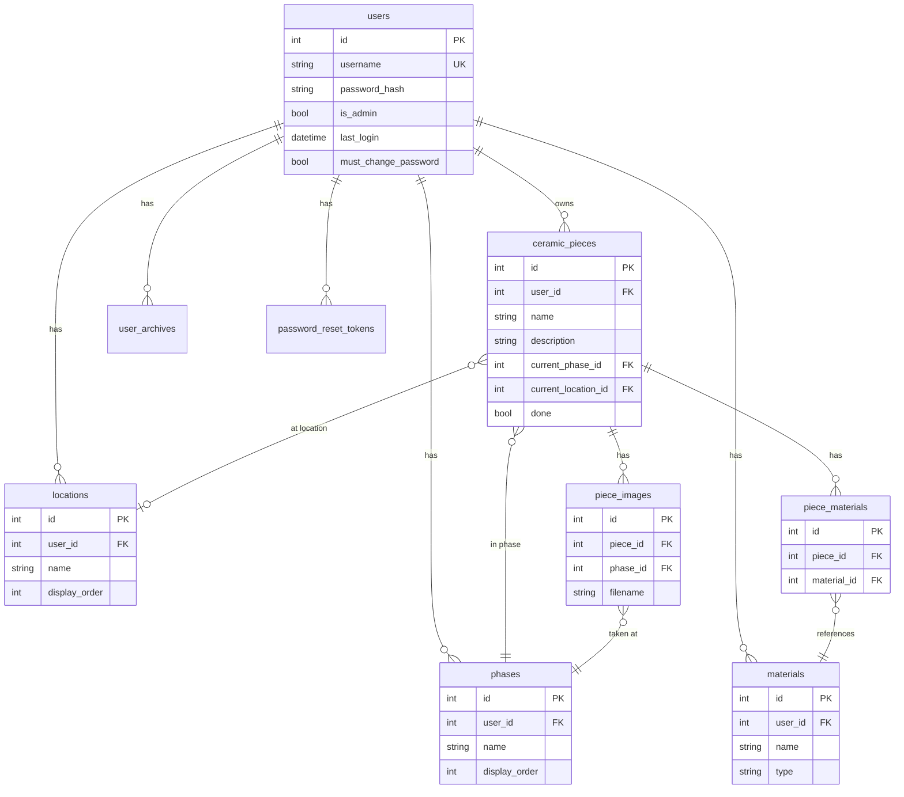
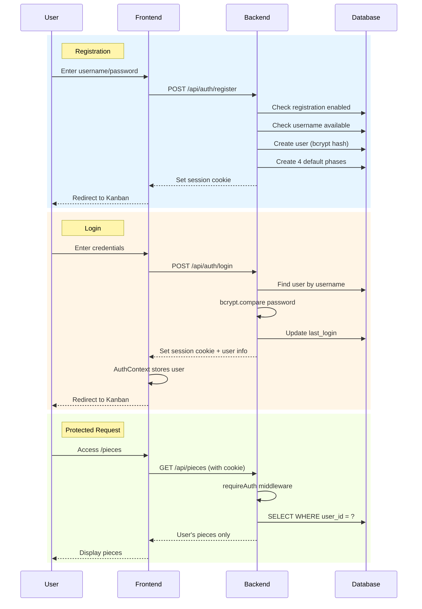
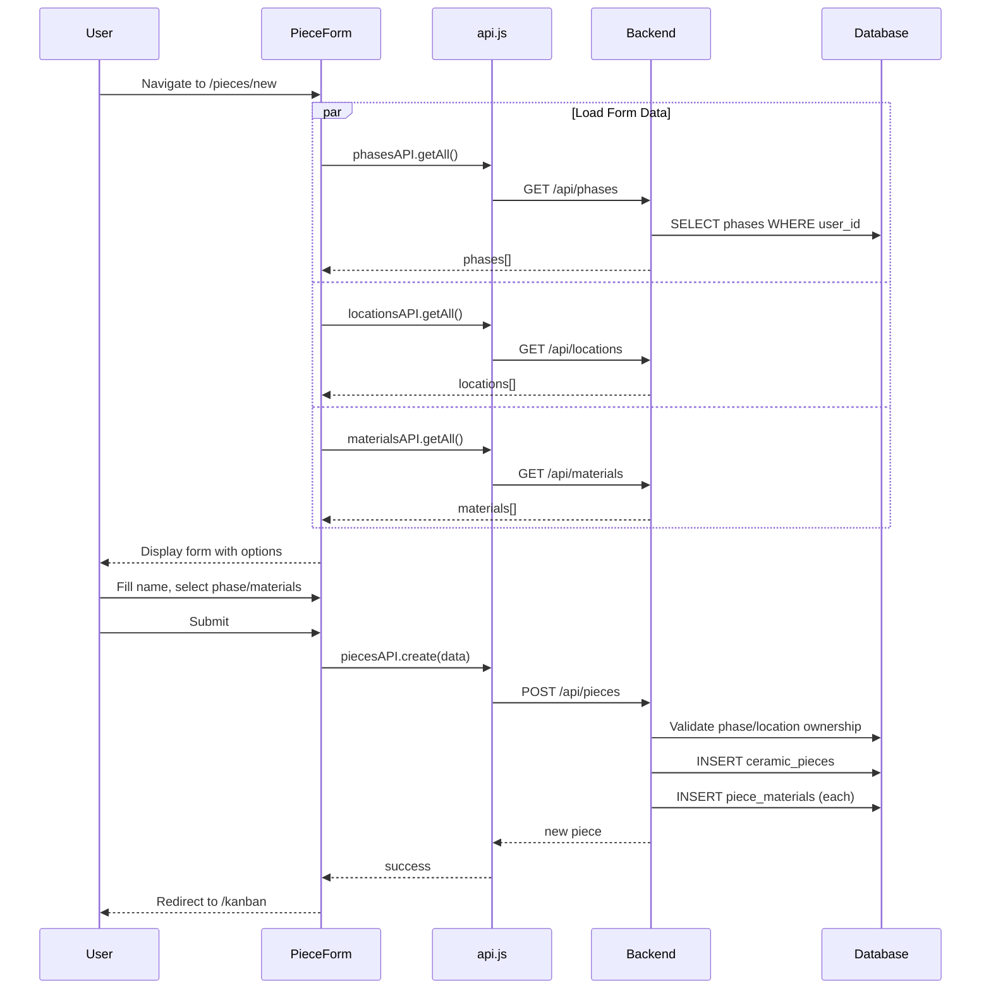
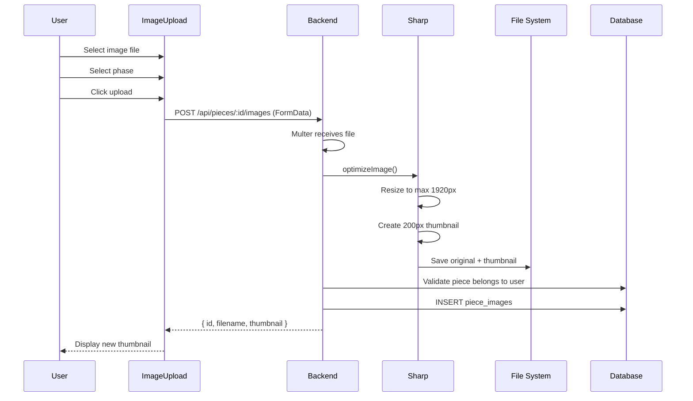
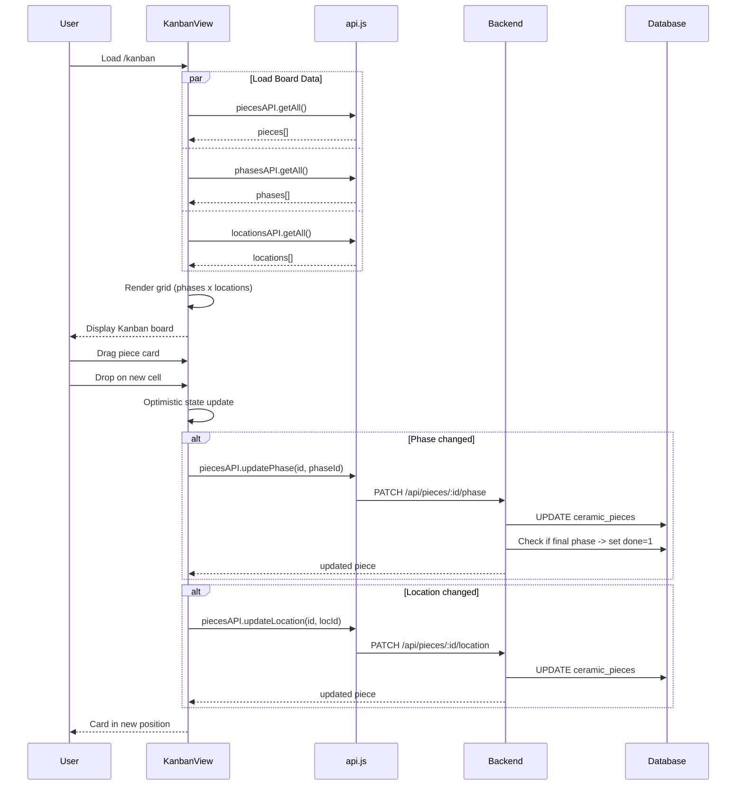
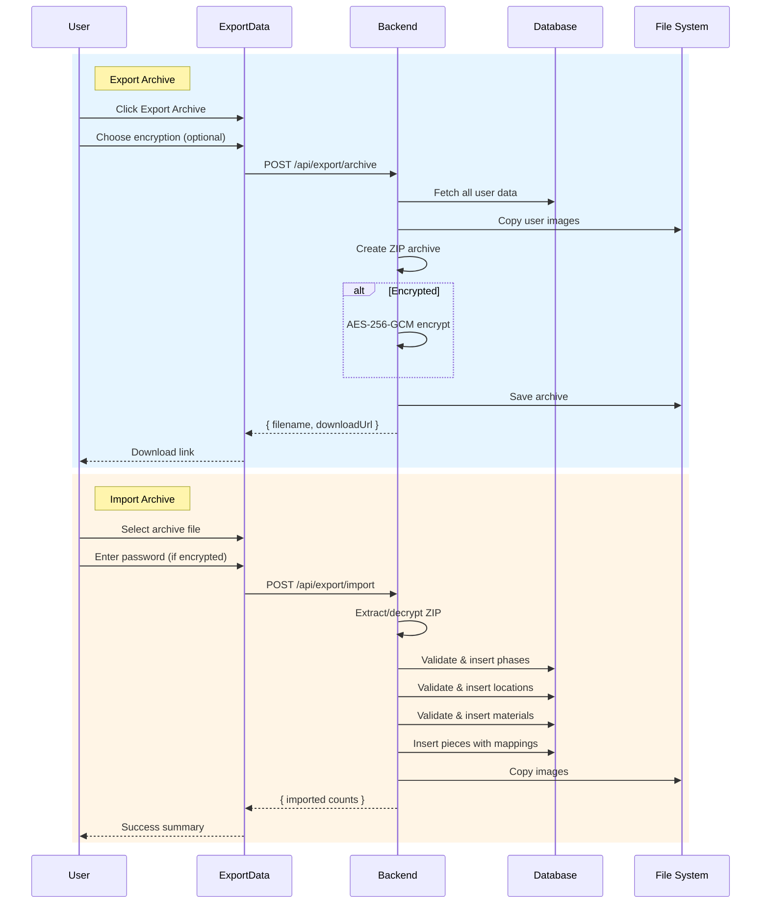
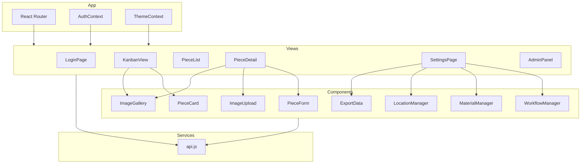

# PotteryTracker - Architecture & Design

## Recommended Tech Stack

### Backend
- **Node.js with Express.js**
  - Why: Mature ecosystem, beginner-friendly, excellent documentation
  - Easy to deploy and extend
  - Great for REST APIs

### Frontend
- **React with Vite**
  - Why: Modern, fast development experience
  - Simple component structure
  - Easy to understand and extend

### Database
- **SQLite**
  - Why: Zero configuration, file-based, perfect for local development
  - Can easily migrate to PostgreSQL later if needed
  - No separate database server required

### File Storage
- **File System (local directory)**
  - Why: Simple and realistic for MVP
  - Images stored in `uploads/` directory
  - Database stores file paths/references

## Database Schema

### Tables

#### 1. `phases`
Stores the lifecycle phases (e.g., "På tork", "Skröjbränd", etc.)
- `id` (INTEGER PRIMARY KEY)
- `name` (TEXT NOT NULL UNIQUE)
- `display_order` (INTEGER) - for sorting phases in UI
- `created_at` (TEXT) - ISO 8601 timestamp

#### 2. `materials`
Stores materials (clays, glazes, etc.)
- `id` (INTEGER PRIMARY KEY)
- `name` (TEXT NOT NULL)
- `type` (TEXT NOT NULL) - 'clay', 'glaze', 'other'
- `created_at` (TEXT)

#### 3. `ceramic_pieces`
Main table for ceramic pieces
- `id` (INTEGER PRIMARY KEY)
- `name` (TEXT NOT NULL)
- `description` (TEXT)
- `current_phase_id` (INTEGER) - FOREIGN KEY to phases(id)
- `created_at` (TEXT)
- `updated_at` (TEXT)

#### 4. `piece_materials`
Junction table for many-to-many relationship between pieces and materials
- `id` (INTEGER PRIMARY KEY)
- `piece_id` (INTEGER) - FOREIGN KEY to ceramic_pieces(id)
- `material_id` (INTEGER) - FOREIGN KEY to materials(id)
- UNIQUE(piece_id, material_id)

#### 5. `piece_images`
Stores image references for ceramic pieces
- `id` (INTEGER PRIMARY KEY)
- `piece_id` (INTEGER) - FOREIGN KEY to ceramic_pieces(id)
- `phase_id` (INTEGER) - FOREIGN KEY to phases(id) - phase when image was taken
- `filename` (TEXT NOT NULL) - stored filename
- `original_filename` (TEXT) - original upload filename
- `created_at` (TEXT)

### Relationships
- ceramic_pieces → phases (many-to-one)
- ceramic_pieces ↔ materials (many-to-many via piece_materials)
- ceramic_pieces → piece_images (one-to-many)

## REST API Endpoints

### Phases
- `GET /api/phases` - Get all phases
- `POST /api/phases` - Create a new phase
- `PUT /api/phases/:id` - Update a phase
- `DELETE /api/phases/:id` - Delete a phase

### Materials
- `GET /api/materials` - Get all materials
- `POST /api/materials` - Create a new material
- `PUT /api/materials/:id` - Update a material
- `DELETE /api/materials/:id` - Delete a material

### Ceramic Pieces
- `GET /api/pieces` - Get all pieces (optional query: ?phase_id=X)
- `GET /api/pieces/:id` - Get a specific piece with materials and images
- `POST /api/pieces` - Create a new piece
- `PUT /api/pieces/:id` - Update a piece
- `DELETE /api/pieces/:id` - Delete a piece
- `PATCH /api/pieces/:id/phase` - Move piece to a different phase
  - Body: `{ phase_id: number }`

### Images
- `POST /api/pieces/:id/images` - Upload image for a piece
  - Multipart form data: file, phase_id
- `GET /api/pieces/:id/images` - Get all images for a piece
- `GET /api/images/:id` - Get image file (serve from file system)
- `DELETE /api/images/:id` - Delete an image

## Project Structure

```
PotteryTracker/
├── backend/
│   ├── server.js              # Express server entry point
│   ├── package.json
│   ├── database/
│   │   ├── init.js            # Database initialization
│   │   └── schema.sql         # SQL schema
│   ├── routes/
│   │   ├── phases.js
│   │   ├── materials.js
│   │   ├── pieces.js
│   │   └── images.js
│   ├── middleware/
│   │   └── upload.js          # Multer config for file uploads
│   └── uploads/               # Image storage directory
│
├── frontend/
│   ├── package.json
│   ├── vite.config.js
│   ├── index.html
│   ├── src/
│   │   ├── App.jsx
│   │   ├── main.jsx
│   │   ├── components/
│   │   │   ├── PieceList.jsx
│   │   │   ├── PieceForm.jsx
│   │   │   ├── PieceDetail.jsx
│   │   │   ├── PhaseManager.jsx
│   │   │   ├── MaterialManager.jsx
│   │   │   └── ImageUpload.jsx
│   │   ├── services/
│   │   │   └── api.js         # API client functions
│   │   └── styles/
│   │       └── App.css
│
├── README.md
└── ARCHITECTURE.md

```

## Design Decisions

1. **SQLite over PostgreSQL**: Simpler setup, no external dependencies. Can migrate later if needed.
2. **File-based image storage**: Simple and realistic. In production, could use cloud storage (S3, etc.).
3. **REST over GraphQL**: Simpler for beginners, easier to understand and debug.
4. **Phase-based image association**: Images are tagged with the phase they represent, providing a visual history.
5. **Separate backend/frontend**: Clear separation of concerns, can be deployed independently later.

---

## Architecture Diagrams

Visual diagrams of the system architecture and key user flows using Mermaid.

### System Architecture



### Database Entity Relationship



### Authentication Flow



### Create Piece Flow



### Image Upload Flow



### Kanban Drag & Drop Flow



### Export/Import Archive Flow



### Component Architecture


